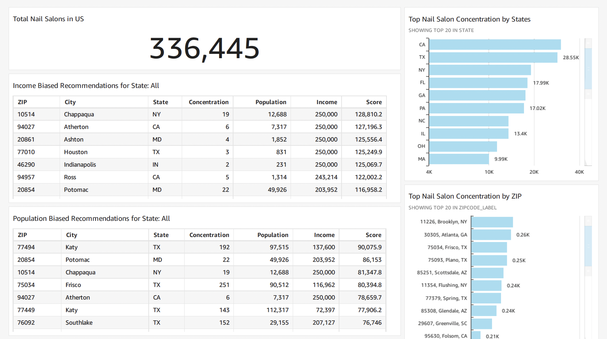
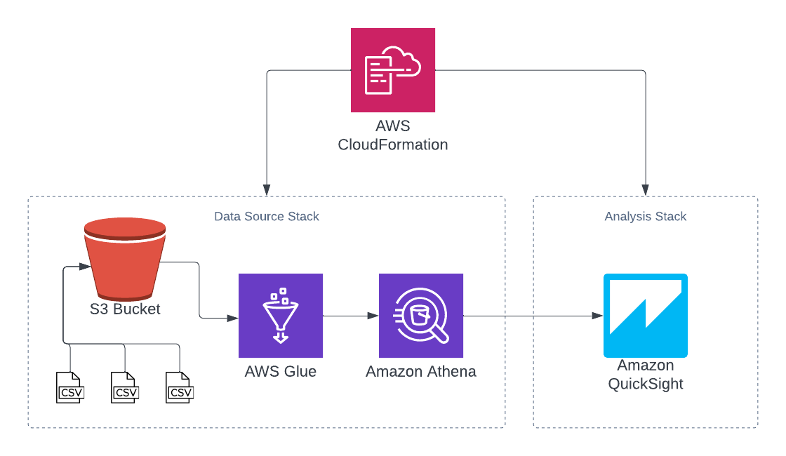
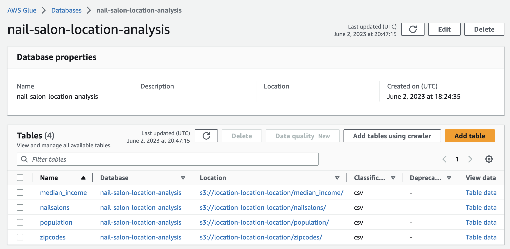
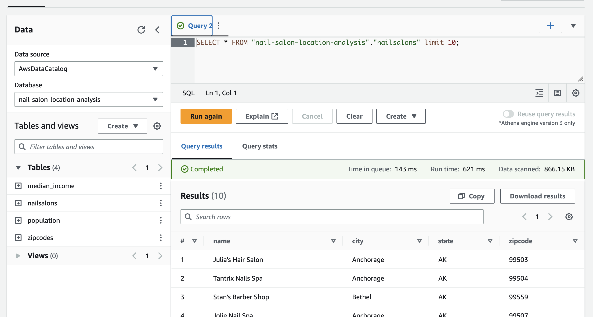
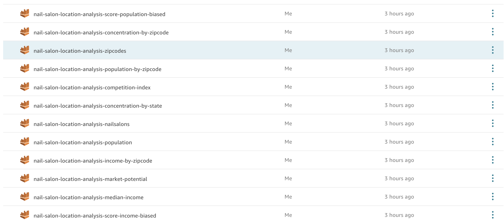
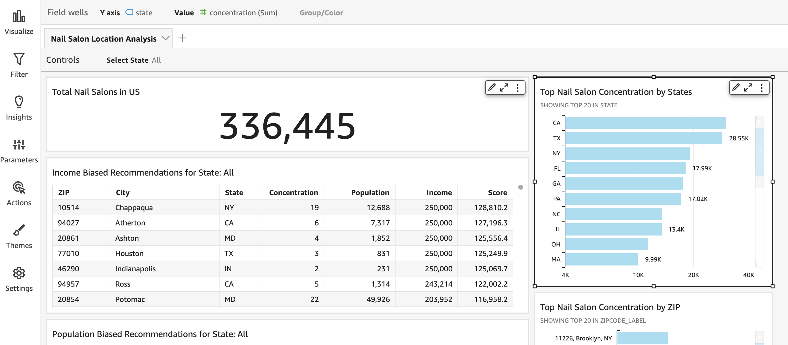

# Location, Location, Location
## <span style="color: #606060;">Find Your Perfect Business Location Using AWS QuickSight and CloudFormation</span>

### Intro
In this article, I will show you how to use AWS QuickSight and CloudFormation to generate analysis reports. I will be using real-world demographics and business directory data to analyze and recommend optimal business locations for your next venture.

Below is a preview of the generated report. To see the full preview version in PDF, [click here](preview.pdf). Within QuickSight Dashboard, you can drill down the results by state.



### Diagram
The infrastructure is as simple as below.


### The Goal
The goal is to give an introduction to BI report automation using QuickSight and CloudFormation. By the end of the article, you should be able to understand how to create your own repeatable, portable, and manageable reports with code.

__The goal IS NOT to tell you that [Chappaqua, NY](https://www.google.com/search?q=chappaqua%2C+new+york) is a great location to start your nail salon business.__

### Prerequisites
- AWS skills
- QuickSight Enterprise edition access

### Disclaimers
- All the data used comes from public sources; accuracy is not guaranteed.
- The [magic formulas](https://github.com/alanzhaonys/business-location-analysis/blob/257400aa6145d7f10d53bbd7d647ad5a39406a82/nested/quicksight.yaml#L359) used to determine optimal locations are not warranted. There are many other factors to consider, such as urban characteristics, real estate, and labor costs, etc.
- Provisioning the resources in AWS will incur costs.

### Steps

Let's begin!

Check out the Git repository at [https://github.com/alanzhaonys/business-location-analysis](https://github.com/alanzhaonys/business-location-analysis)

#### Repository Overview
- `/data` - This directory contains the data you need to upload to your own S3 bucket
  - Demographics CSV files
    - `zipcodes/zipcodes.csv`
    - `median_income/median_income.csv`
    - `population/population.csv`
  - Business directory CSV files
    - `nailsalons/nailsalons.csv` - nail salon business directory
    - `florists/florists.csv` - florist business directory
- `/template.yaml` - The main CloudFormation template
- `/nested` - The nested CloudFormation template directory
  - `datasoure.yaml` - Creates Glue tables
  - `quicksight.yaml` - Creates QuickSight data source, data sets, analysis, template and dashboard
- `/deploy.sh` - Helper script to deploy the CloudFormation template

#### S3 Buckets
Create two S3 buckets, one to hold the raw data, another to hold the nested CloudFormation templates. In my case, I created:
- `s3://location-location-location`
- `s3://cfn-libraries-cloudformation`

Upload all files in `/data` *(not the directory itself)* to `s3://location-location-location`.

You can either do it manually or use the command below. *(Be sure to use your own S3 bucket, region and profile)*:
```
aws s3 sync "data" "s3://location-location-location" --delete --region "us-east-1" --profile default
```

#### Preparations
__Get your QuickSight ARN. You will need to have QuickSight Enterprise subscription. Run command below.__
```
aws quicksight list-users --region <aws-region> --aws-account-id <account-id> --namespace <namespace-name>       
```

__Update the variables in `deploy.sh` script.__
```
#!/bin/bash

# e.g. nailsalon-location-analysis
APP_NAME=[REPLACE-ME]
# e.g. default or your custom profile
PROFILE=[REPLACE-ME]
# e.g. us-east-1 or us-west-2
REGION=[REPLACE-ME]
# e.g. the bucket you just created to hold nested CloudFormation templates
CLOUDFORMATION_BUCKET=[REPLACE-ME]

...
```

The deploy script will package, send packaged template to S3 and deploy to CloudFormation.

__Update the variables in `template.yaml` CloudFormation template.__
```
Parameters:
  AppName:
    Type: String
    Default: "nail-salon-location-analysis"
    Description: >-
      The application name. This will become the Glue database and QuickSight analysis ID.

  AppLongName:
    Type: String
    Default: "Nail Salon Location Analysis"
    Description: >-
      The user friendly application name. This will become the QuickSight analysis and dashboard names.

  BusinessNameSingular:
    Type: String
    Default: "Nail Salon"
    Description: >-
      Business name in singular notion. This will show up in the QuickSight report.

  BusinessNamePlural:
    Type: String
    Default: "Nail Salons"
    Description: >-
      Business name is plural notion. This will show up in the QuickSight report.

  BusinessSlug:
    Type: String
    Default: "nailsalons"
    Description: >-
      A slug for the business in plural notion. This should matches the data directory at `/data/nailsalons`.

  DataS3Bucket:
    Type: String
    Default: "your-data-bucket"
    Description: >-
      The S3 bucket to hold the raw data at `s3://your-data-bucket`.

  QuickSightArn:
    Type: String
    Default: "your-quicksight-arn"
    Description: >-
      The QuickSight ARN. You will need to have QuickSight Enterprise subscription.
      Use this command to find out the ARN: 
        aws quicksight list-users --region <aws-region> --aws-account-id <account-id> --namespace <namespace-name>

...
```
#### Deployment
Run `./deploy.sh` to deploy the CloudFormation template. Wait for few minutes for resources to be created.

#### Glue Database and Tables


#### Athena


#### QuickSight Data Sets


#### QuickSight Analysis


### What's Next
You can absolutely create all the AWS resources manually, but perhaps next time you create new reports, you will have an option to automate your workflow. This is especially helpful if you need to create multiple similar QuickSight reports or share them across accounts.

To be fair, there is a lot of CloudFormation code you have to write, so it might not be worth the time to do it this way. In my case, I can replicate the reports for a variety of business types, and it's totally worth it. Additionally, keeping and tracking everything in code seems to be the better practice.

There are two ways to generate QuickSight reports with CloudFormation that I know of. They will make more sense after you take a deep dive into using this methodology.

#### Code analysis definitions manually
Analysis definitions hold the information about fields, filters, parameters and layouts. It can be overwhelming to put everything together, but it allows you to create a brand new QuickSight analysis without relying on a base analysis. __This is the method I chose for this article.__ The [describe-analysis-definition](https://docs.aws.amazon.com/cli/latest/reference/quicksight/describe-analysis-definition.html) helped me a lot by providing majority of the `QuickSight::Definition` CloudFormation context from an existing analysis as guidelines.

Take a look at the `QuickSight::Definition` use in this article [here](https://github.com/alanzhaonys/business-location-analysis/blob/257400aa6145d7f10d53bbd7d647ad5a39406a82/nested/quicksight.yaml#L958).

#### Derive from a maually created analysis
1. Create a template from the base analysis using [create-template](https://docs.aws.amazon.com/cli/latest/reference/quicksight/create-template.html) CLI. There is no option to do it from the console
2. [Create all the data sets with CloudFormation](https://docs.aws.amazon.com/AWSCloudFormation/latest/UserGuide/aws-resource-quicksight-dataset.html)
3. Get the new template's ARN from the step 1 CLI command result. [Create a new template with CloudFormation](https://docs.aws.amazon.com/AWSCloudFormation/latest/UserGuide/aws-resource-quicksight-template.html) and specify the ARN as the `SourceEntity::SourceTemplate::Arn`
4. [Create a new analysis with CloudFormation](https://docs.aws.amazon.com/AWSCloudFormation/latest/UserGuide/aws-resource-quicksight-analysis.html) from the new template
   1. Get the list of data sets from [list-data-sets](https://docs.aws.amazon.com/cli/latest/reference/quicksight/list-data-sets.html) CLI because you need to specify `SourceEntity:SourceTemplate:DataSetReferences`
   2. Map the data set placeholder name of the __base template__ to the new data set
5. Finally, [create the dashboard from the new template using CloudFormation](https://docs.aws.amazon.com/AWSCloudFormation/latest/UserGuide/aws-resource-quicksight-dashboard.html)
   1. Map the data set placeholder name of the __base template__ to the new data set

__OMG! There are lots of hoops through which you have to go. I hope AWS can make it easier, for example, convert existing analysis into CloudFormation template with a click of button.__ One of the caveats of using second method is that you always have to keep the base analysis and template because that's where derived analyses get the information like fields, filters, parameters, and layouts from.

### Feedback
Please reach out to me directly on the platform if you have any feedback.

### Credits
- [Automate deployment of an Amazon QuickSight analysis connecting to an Amazon Redshift data warehouse with an AWS CloudFormation template](https://aws.amazon.com/blogs/big-data/automate-deployment-of-an-amazon-quicksight-analysis-connecting-to-an-amazon-redshift-data-warehouse-with-an-aws-cloudformation-template/)
- US ZIP codes: [https://github.com/amitavmohanty/US-Zip-codes-Postal-codes](https://github.com/amitavmohanty/US-Zip-codes-Postal-codes)
- US population: [https://github.com/fissehab/US_Population_Data](https://github.com/fissehab/US_Population_Data)
- US median income: [https://github.com/UPchieve/zipcode-income](https://github.com/UPchieve/zipcode-income)
- Business directories are crawled by me legally and ethically from public source
